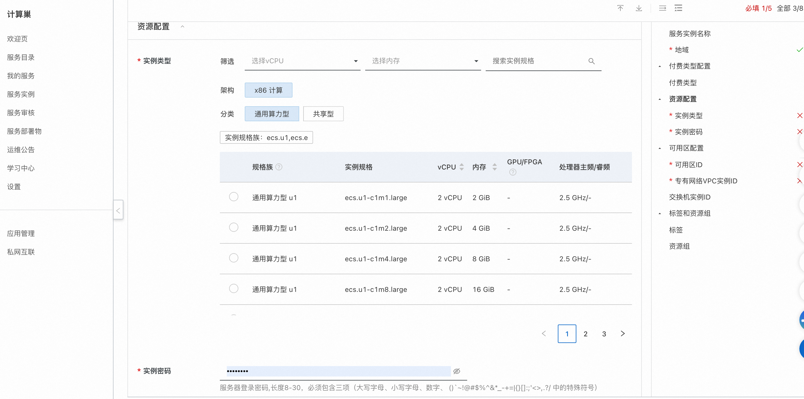

<h1>one-api Service Instance Deployment Document </h1>

<h2> Overview </h2>

one-api is an open source OpenAI interface management & distribution system, which supports Azure, Anthropic Claude, Google PaLM 2 & Gemini, Zhipu ChatGLM, Baidu Wenxin Yanyan, xunfei spark cognition, Ali Tongyi Qian Wen, 360 Zhinao and Tencent mixed yuan, etc. It can be used for secondary distribution management key.
See <a href = "https://github.com/songquanpeng/one-api">one-api</a>.

<h2> Billing instructions </h2>

 The cost of the one-api in calculating the nest mainly involves:

 Selected vCPU and Memory Specifications
Disk Capacity
public network bandwidth
Billing methods include:
-Pay-As-You-Go (hours)
-Package year and package month
The estimated cost can be seen in real time when the instance is created. 

<h2> Deployment Architecture </h2>

One Api Community Edition is a stand-alone deployment architecture. 

<h2> Permissions required for RAM accounts </h2>

One Api service needs to access and create resources such as ECS and VPC. If you use a RAM user to create a service instance, you need to add the corresponding resource permissions to the account of the RAM user before creating the service instance. For more information about how to add RAM permissions, see <a href = "https://help.aliyun.com/document_detail/121945.html"> Authorize RAM users </a>.
. The required permissions are shown in the following table. 

<table>
<thead>
<tr>
<th> Permission policy name </th>
<th> Remarks </th>
</tr>
</thead>
<tbody>
<tr>
<td>AliyunECSFullAccess</td>
<td> Permissions to manage ECS </td>
</tr>
<tr>
<td>AliyunVPCFullAccess</td>
<td> Permissions for managing VPC networks </td>
</tr>
<tr>
<td>AliyunROSFullAccess</td>
<td> Manage permissions for Resource Orchestration Services (ROS) </td>
</tr>
<tr>
<td>AliyunComputeNestUserFullAccess</td>
<td> Manage user-side permissions for the compute nest service (ComputeNest) </td>
</tr>
<tr>
<td>AliyunCloudMonitorFullAccess</td>
<td> Permissions to manage CloudMonitor (CloudMonitor) </td>
</tr>
</tbody>
</table>

<h2> Deployment process </h2>

<h3> Deployment steps </h3>

<ol>
<li> Click <a href = "https://computenest.console.aliyun.com/service/instance/create/default?type=user&ServiceName=One API Community Edition"> Deployment Link </a> to go to the service instance deployment page. </li>
<li> according to the interface prompt, fill in the parameters to complete the deployment.

2.png" />
6.png" /></li>
<li> After setting the parameters, click Next to confirm the order, click Create Now, and wait for the service instance to be created. </li>
<li> After the service instance is created, go to the service instance details page. one-api login information can be obtained on the overview page.
3.png" />
4.png" /></li>
</ol>
