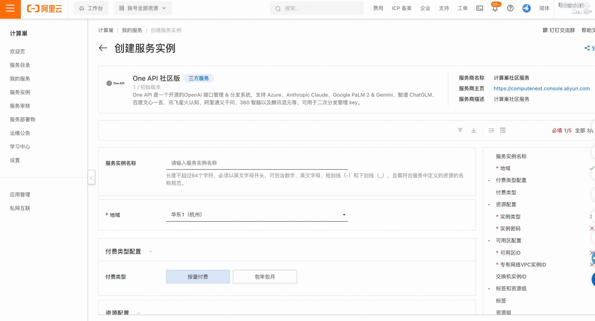
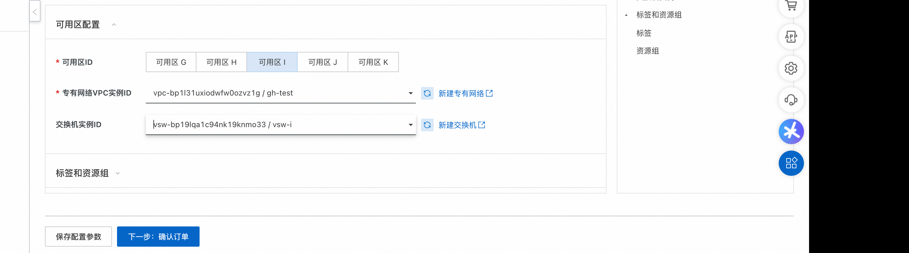
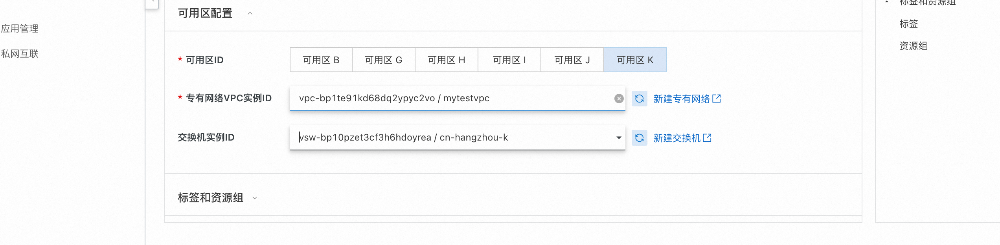
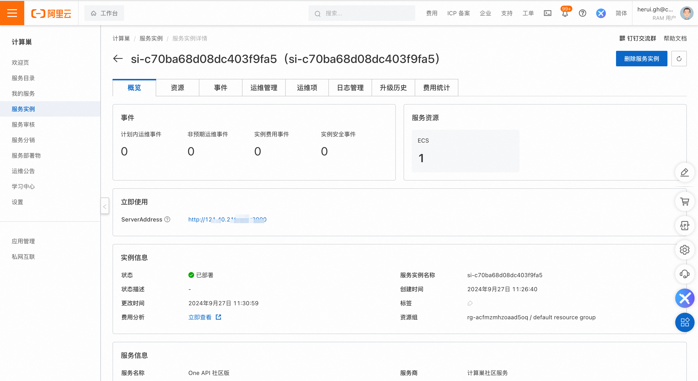
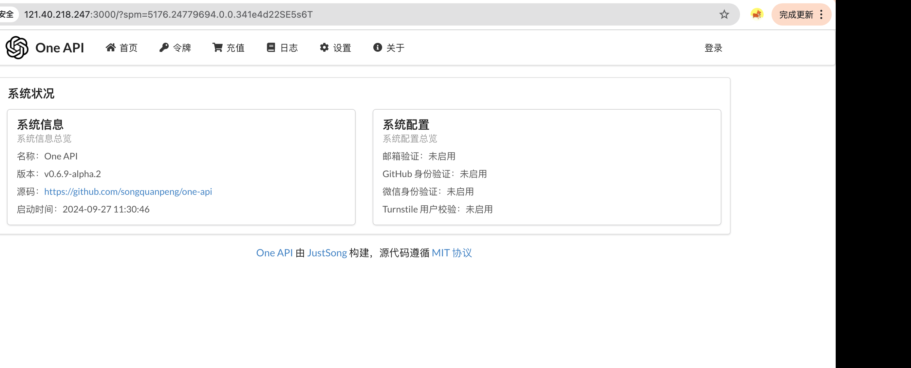

# one-api服务实例部署文档

## 概述

one-api是一个开源的OpenAI 接口管理 & 分发系统，支持 Azure、Anthropic Claude、Google PaLM 2 & Gemini、智谱 ChatGLM、百度文心一言、讯飞星火认知、阿里通义千问、360 智脑以及腾讯混元等，可用于二次分发管理 key。
详情请看 [one-api](https://github.com/songquanpeng/one-api).

## 计费说明

one-api在计算巢上的费用主要涉及：

所选vCPU与内存规格
磁盘容量
公网带宽
计费方式包括：
- 按量付费（小时）
- 包年包月
预估费用在创建实例时可实时看到。

## 部署架构

One Api社区版是单机部署架构。

## RAM账号所需权限

One Api服务需要对ECS、VPC等资源进行访问和创建操作，若您使用RAM用户创建服务实例，需要在创建服务实例前，对使用的RAM用户的账号添加相应资源的权限。添加RAM权限的详细操作，请参见[为RAM用户授权](https://help.aliyun.com/document_detail/121945.html)
。所需权限如下表所示。

| 权限策略名称                          | 备注                         |
|---------------------------------|----------------------------|
| AliyunECSFullAccess             | 管理云服务器服务（ECS）的权限           |
| AliyunVPCFullAccess             | 管理专有网络（VPC）的权限             |
| AliyunROSFullAccess             | 管理资源编排服务（ROS）的权限           |
| AliyunComputeNestUserFullAccess | 管理计算巢服务（ComputeNest）的用户侧权限 |
| AliyunCloudMonitorFullAccess    | 管理云监控（CloudMonitor）的权限     |

## 部署流程

### 部署步骤

1. 单击[部署链接](https://computenest.console.aliyun.com/service/instance/create/default?type=user&ServiceName=One%20API%20%E7%A4%BE%E5%8C%BA%E7%89%88)，进入服务实例部署界面。
2. 根据界面提示，填写参数完成部署。

3. 设置完参数后，点击下一步确认订单，点击立即创建，等待服务实例创建完成。
4. 服务实例创建成功后，进入服务实例详情页。在概览页可获取one-api登录信息。

    <footer>
        
查看更多计算巢服务(https://computenest.aliyun.com)

    </footer>

   
